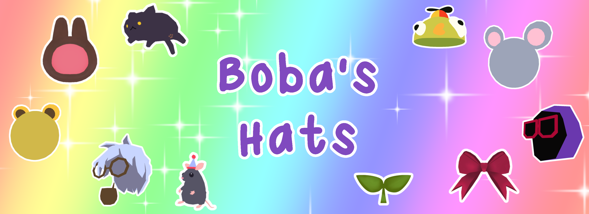



# Boba's Hats

A mod for PEAK that adds new, custom hats to the game!

## Description

This mod patches the character customization system
to load custom hat models and icons from our AssetBundle.
It can also serve as an example for anyone to create and
distribute their own hat packs!

## Installation

1. Download and install the mod from
   [Thunderstore](https://thunderstore.io/c/peak/)!

2. Launch the game, and the new hats should appear
   in the Passport menu!

# Join our Community!

# Show your support!

> From humble beginnings in 1927, Cats Protection has grown to become the UK's leading cat charity.
> We help an estimated 157,000 cats and kittens a year through our national network which includes around 210 volunteer-run branches and 34 centres.
> Our work doesn’t stop there, however: we also provide an array of cat care information via our publications, help and advice section and National Information Line; promote the benefits of neutering to prevent unwanted litters from being born and becoming the abandoned cats of tomorrow and seek to educate people of all ages about cats and their care.

